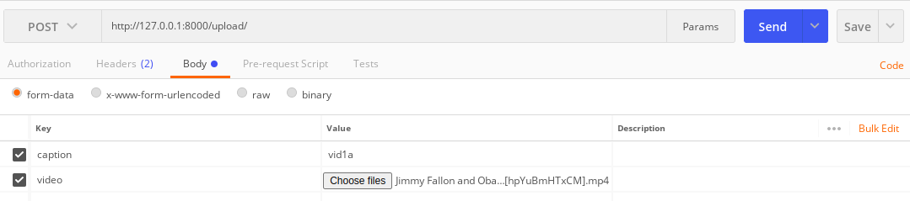
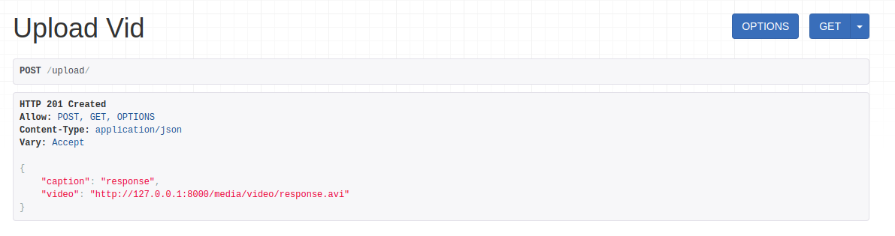

# Facial recognition on video


1. Create a conda environment .conda


2. Clone and build dlib from source:
```console
$ git clone https://github.com/davisking/dlib.git
$ cd dlib
$ mkdir build
$ cd build
$ cmake .. -DDLIB_USE_CUDA=1 -DUSE_AVX_INSTRUCTIONS=1 -DCUDAToolkit_ROOT=/path/to/your/nvcc/bin/
$ cmake --build .
$ cd ..
$ python setup.py install --set DLIB_USE_CUDA=1
```


3. Install dependencies:
```console
$ cd project/
$ pip install -r requirements.txt
```


4. Put face images of people you want to recognize to project/Image with file name {person_name}0.jpg


5. Image augmentation:
```console
$ cd Image/
$ python augmentation.py
```


6. Image encode:
```console
$ python encode.py
$ cd ..
```


7. Run Django server:
```console
$ python manage.py makemigrations
$ python manage.py migrate
$ python manage.py runserver
```


8. Post video:
- Using Postman:




- Using video upload site:





9. Download video 


